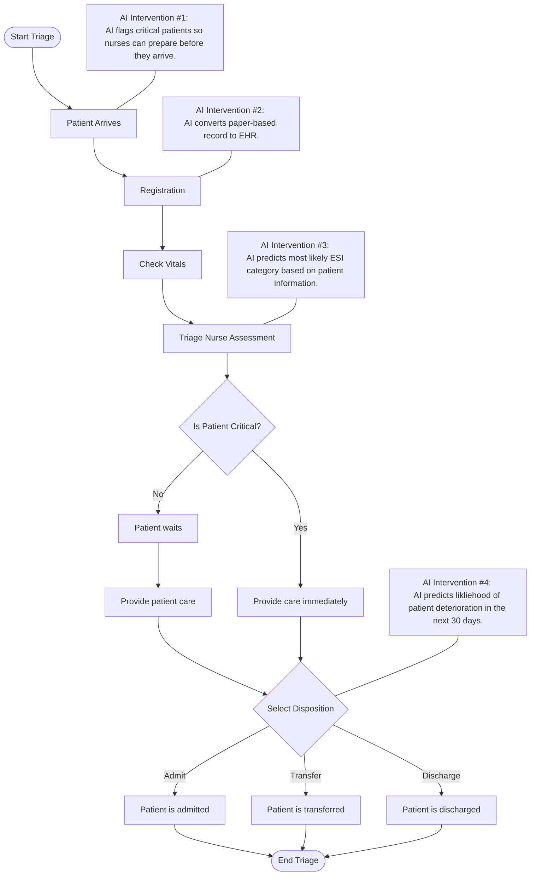

```mermaid
flowchart TB
    start([Start Triage]) --> a[Patient Arrives]
    a --> b[Registration]
    b --> d[Check Vitals]
    d --> e[Triage Nurse Assessment]
    e --> f{Is Patient Critical?}
    f --> |Yes| g[Provide care immediately]
    f --> |No| h[Patient waits]
    h --> i[Provide patient care]
    j{Select Disposition}
    i --> j
    g --> j

    j --> |Admit| k[Patient is admitted]
    j --> |Transfer| l[Patient is transferred]
    j --> |Discharge| m[Patient is discharged]
    finish([End Triage])

    k --> finish
    l --> finish
    m --> finish

    ai_1[AI Intervention #1: <br>AI flags critical patients so nurses can prepare before they arrive. ]
    ai_1 --- a

    ai_2[AI Intervention #2: <br>AI converts paper-based record to EHR. ]
    ai_2 --- b

    ai_3[AI Intervention #3: <br>AI predicts most likely ESI category based on patient information.]
    ai_3 --- e

    ai_4[AI Intervention #4: <br>AI predicts likliehood of patient deterioration in the next 30 days.]
    ai_4 --- j
```