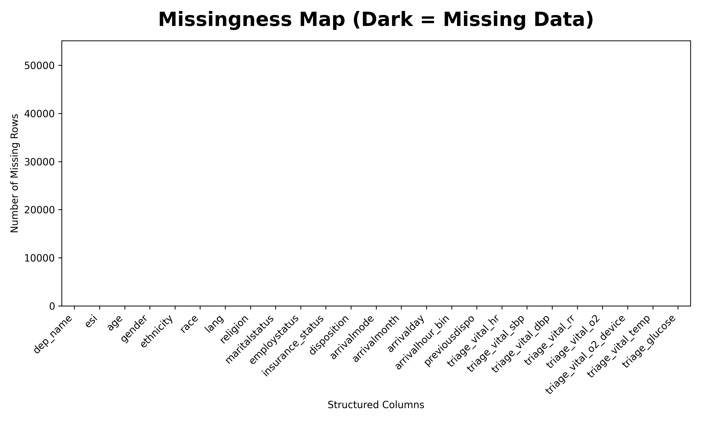
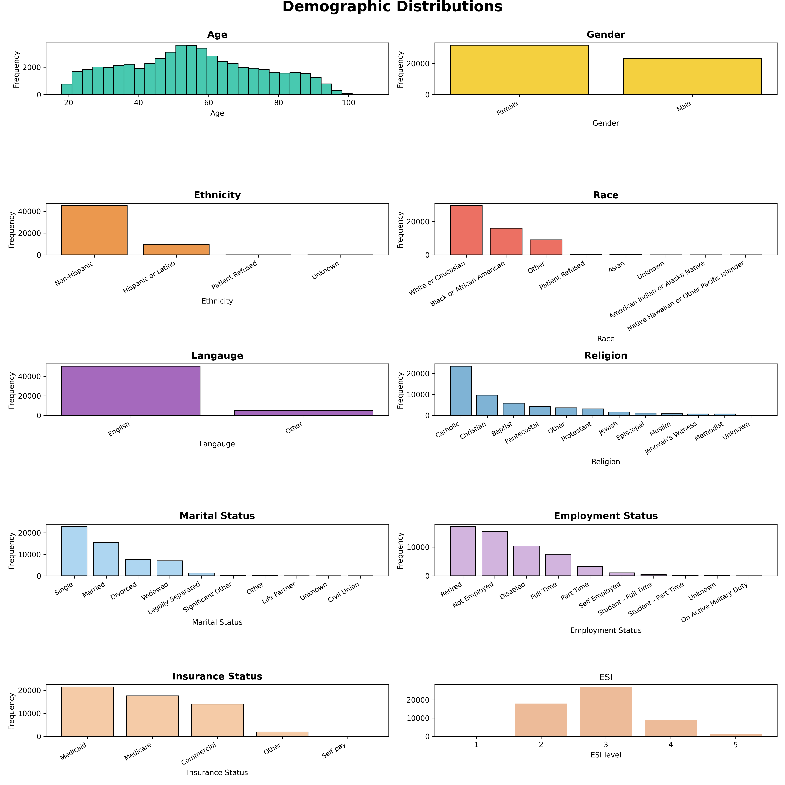
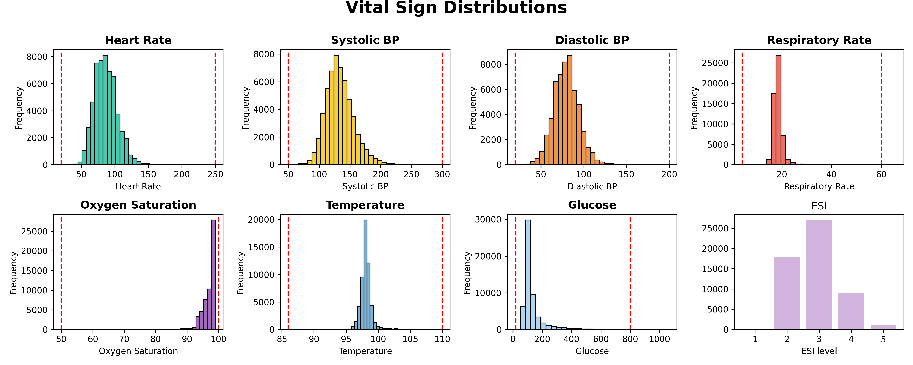
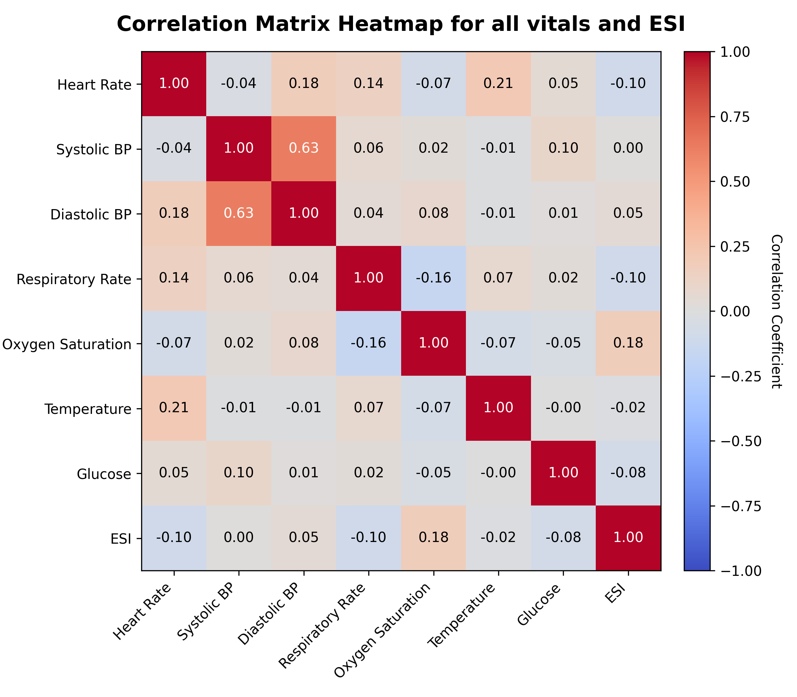
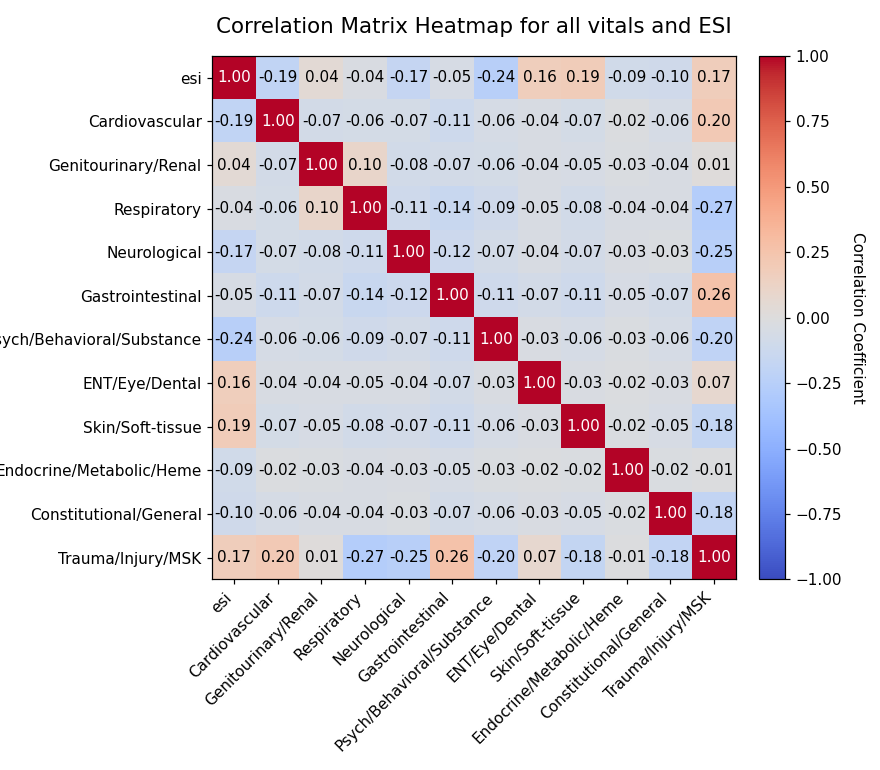
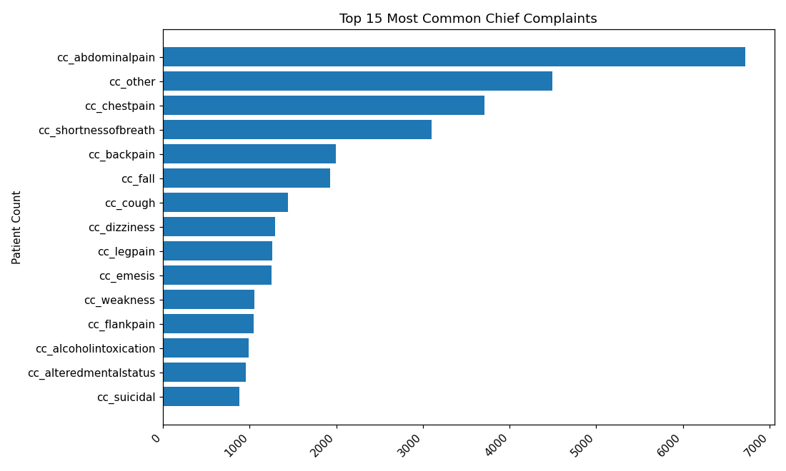
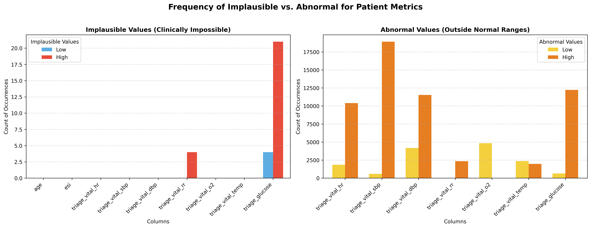

# **Week 5 \- Feasibility Memo** 

Name: Rhys Brown

## **Final Verdict on Dataset**

> [!NOTE]
> The data is **suitable** for the development and evaluation of a baseline AI-triage model as long as real-world verification against Caribbean and paediatric cohorts is done **before** deployment.

## **Data Summary**

The dataset contains the triage data associated with 55,121 emergency department encounters within the United States. It shows Emergency Severity Index (ESI) along with 225 other features; 200 of the features relate to the presence or absence of specific chief complaints from a patient while the other 25 relate to other factors such as vital signs. Preliminary data exploration identified 29 obviously clinically impossible values within the dataset, 25 of which belonged to the glucose column and 4 which belonged to respiratory rate. 

### **Major Feature Summary**
- **225** Features relating to ESI.
- Only **29** clinically impossible values, observed in roughly **0.05%** of all cases.
- ESI level 1 and 5 only make up roughly **0.13%** and **2%** of the total cases respectively.

## **Top 3 Concerns**

The dataset has three (3) major concerns that affect its applicability in the context of Caribbean Triage:
### **1. No Minors in Dataset**
- **Risk:** The dataset has no minors (people under the age of 18).
- **Impact:** The model has no basis to accurately evaluate paediatric trends. This would make the risk that the model is unsafe to use with children unacceptably high.
- **Mitigation:** Any models trained on the dataset must be externally validated on a paediatric sample before deployment.
### **2. America-centric Demographics**
- **Risk:** The dataset contains a sample of the American population.
- **Impact:** The observed demographic distribution does not reflect that of most Caribbean islands. As such the disease patterns and patient presentation present in the dataset may not transfer directly to the Caribbean.
- **Mitigation:** Any resulting models trained on the dataset must be externally validated on a representative dataset from a Caribbean emergency department before being deployed in the region.
### **3. Class Imbalance in Acuity Level**
- **Risk:** The dataset has limited examples of ESI level 1 and 5.
- **Impact:** This may cause any model trained on the dataset to be biased toward the more common ESI level 3. This may lead to poor sensitivity for critical cases, possibly increasing the rate of mistriage. 
- **Mitigation:** Specific sampling techniques can be employed to mitigate the class imbalance. For example, smaller classes can be sampled at a higher rate.

## **Top 3 Reasons to Proceed**

That said, the dataset still has many qualities that make it a valuable training tool. 
### **1. Patient Chief Complaints Exposed**
The dataset shows the chief complaints of patients. Many datasets only show vitals thus limiting the features that can be used in ESI prediction. Chief complaints reflect information directly used by triage nurses to determine acuity level. 
### **2. No Missing Values**
The dataset has no missing values, meaning that all 55,121 records can be used to train and test the model with minimal required preprocessing. 
### **3. Most Values are Clinically Plausible**
The dataset has the advantage of minimal data entry errors; most values are within the realm of plausibility. This suggests the dataset is of generally good quality.

## **Caveats**

Therefore the dataset can be used provided the following five caveats are respected: 
### **1. Data must be validated on children**
The dataset cannot be used to train a machine learning model that can reliably triage children. Paediatric data must be sourced separately provided that legal and ethical boundaries are respected.
### **2. Data may not generalise to Caribbean**
The dataset is not centred on the Caribbean; so, local patterns may be missed. 
### **3. Data Leakage is possible**
The disposition columns are included within the dataset and must be handled carefully to prevent data leakage. This is where the model obtains data it should not have and achieves artificially inflated performance.
### **4. No Strong individual relationships to ESI**
Preliminary analysis showed that no single feature had a strong linear relationship with ESI levels. This suggests that ESI prediction may depend more on complex multi-variable relationships than any one feature.
### **5. ESI Class Imbalance**
Low number of ESI levels 1 and 5 cases may reduce model performance on these under-represented classes, increasing the likelihood of mistriage. Therefore the rate of false negatives for ESI level 1 cases must be tracked closely.

## **Top 10 Features** 
| Rank | Feature Name | Justification |
| :--- | :--- | :--- | 
|1 | `triage_vital_o2` | The level of oxygen saturation key metric of bodily health. Low saturation is strongly correlated with more critical ESI levels. |
|2 | `cc_chestpain` | Chest pain is a symptom of urgent medical emergencies like heart attacks or pulmonary embolism. |
|3 | `cc_shortnessofbreath` | Shortness of breath typically implies compromised respiration which can lead to starvation of oxygen to bodily tissues. |
|4 | `cc_suicidal`| Suicidal presentations have high risk of self-harm and need immediate psychiatric evaluation. |
|5 | `cc_alteredmentalstatus` | Altered mental status indicates neurological, infectious and/or metabolic issues. |
|6 | `cc_motorvehiclecrash` | Motor vehicle crashes are associated with potentially severe bodily trauma which must be assessed immediately.|
|7 | `cc_weakness` | Weakness is may indicate medical emergencies such as stroke. |
|8 | `triage_vital_rr` | High or low respiratory rate may indicate respiratory distress. Furthermore, it is also easy to acquire quickly at triage. |
|9 | `triage_vital_hr`| High or low heart rates imply a cardiovascular instability and compensation for acute physiological stress. |
|10 | `cc_dentalpain` | Dental pain is typically a sign of infection which can quickly spread across the body. It was shown to be correlated with ESI levels|

## **List of Figures**

**Figure 1:** Heat map showing the number of missing values for the demographic features and clinical metrics (0 in this case).

**Figure 2:** Bar charts showing the distribution of various demographic features in the dataset.

**Figure 3:** Bar charts showing the Distribution of various Vital Signs in the dataset.

**Figure 4:** Correlation Matrix comparing Vital Sign and ESI within the dataset.

**Figure 5:** Correlation Matrix comparing Chief Complaints and ESI within the dataset.

**Figure 6:** Horizontal Bar chart showing the Top 15 Chief Complaints in the dataset by frequency.

**Figure 7:** Bar charts showing the frequency of Implausible and Abnormal Values in the dataset.
