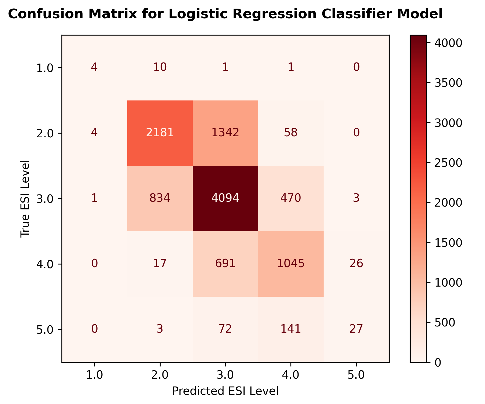
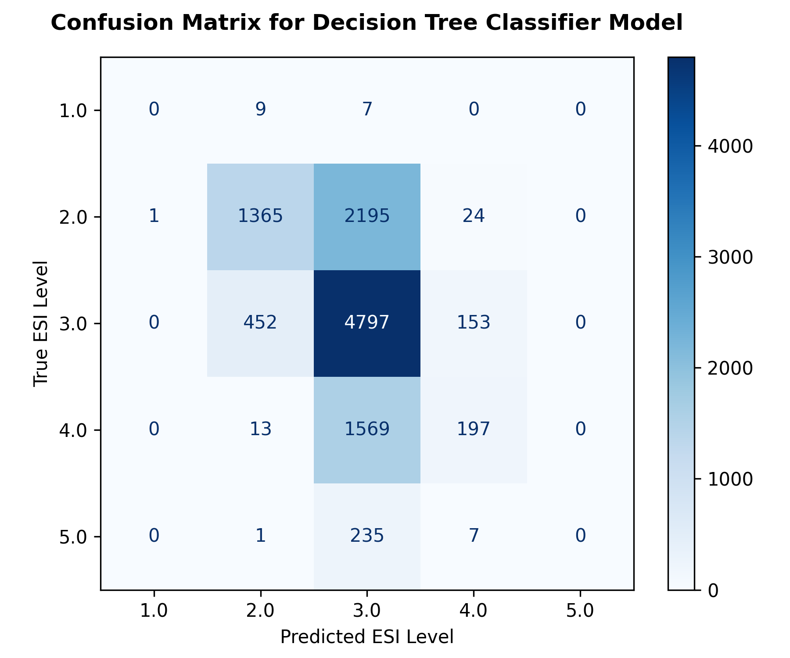
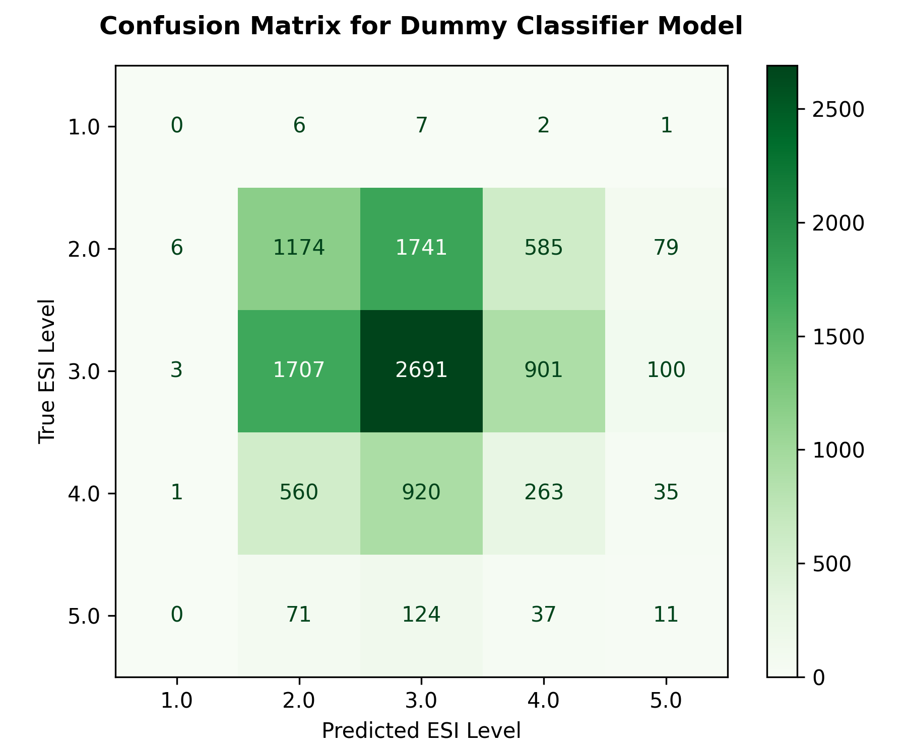

# **Week 6 - Baseline Model Report**

Name: Rhys Brown

## **Dataset Recap** 
The dataset contains the triage data associated with 55,121 emergency department encounters within the United States. It consisted of Emergency Severity Index (ESI) score along with 225 other features taken from each encounter.

### Cons:
1. No minors included in dataset.
2. Dataset was a sample taken entirely from the United States.
3. Major class imbalance observed as ESI level 1 and 5 cases were rare, only making up roughly **0.13%** and **2%** of the total cases respectively, leaving little data for the models to learn on.

### Pros:
1. Chief Patient complaints shown for each encounter.
2. No missing values.
3. Most triage vitals were possible as only **29** clinically impossible values were observed, roughly **0.05%** of all cases.

## **Model Descriptions** 

Three (3) models were trained on the dataset and compared against one another:
- **Logistic Regression:** a machine learning classifier that predicts the likelihood of a given class which is then mapped to a class based on whether it is above or below a threshold. 
- **Decision Trees:** A machine learning algorithm that classifies data by a series of yes/no decisions. The depth of the model refers to number of decisions from the first decision to the final output. Maximum depth of 10 was chosen to ensure the model was large enough whilst also not becoming too complex, learning from noise as opposed to genuine patterns.
- **Dummy Classifier:** a classifier that select output classes based on simple rules, not based on patterns found in the data. It is used as a baseline to compare against the previous models.

> [!NOTE]
> **Classifiers** are algorithms that express output in terms of discrete classes instead of continuous data based on a given input.

## **Benchmark Table**  

**Table 1:** Table showing the accuracy, macro F1 and recall for the ESI 1 class for the three tested models.

| Model  | Accuracy | Macro F1 | Weighted F1 | Recall (ESI 1) |
|-------|-----|------------| ------------| ------------|
| Logistic Regression*    | 0.667 | 0.492| 0.661 | 0.250|
| Decision Tree  | 0.577   | 0.272 | 0.524 |0.000 |
| Dummy (Baseline) | 0.375|  0.204  | 0.375 | 0.000 |

> [!IMPORTANT]
> - The **Logistic Regression** model was the most successful model tested. It was the **only** model that was able to correctly evaluate any ESI 1 triage cases.
> - **Macro F1** computes the F1 score for each class then takes the arithmetic mean for them. **Weighted F1** weighs the F1 score for classes based on the overall class balance.
 
## **Metric Justification**

The most important performance metric for evaluating model efficacy was the **ESI Level 1 recall**. This is important as class recall measures how many cases were triaged incorrectly for a given class. This is in contrast to typical recall which measures all cases of mistriage. Class recall, specifically is prioritized in the case of triage as some classes have steeper consequences when mistriaged compared to others. In the case of ESI Level 1, any incorrect triage is extremely dangerous as the other available acuity levels are all lower priority. When a patient is truly level 1, they require immediate urgent intervention which is not provided to lower acuity levels. This has the potential to result in patient deterioration and worsened health outcomes. Therefore, in order to prevent these dangerous false negatives, it is imperative to design models with a recall as close to 1 as possible (no mistaken undertriage for a given acuity).

## **Failure Modes**

Consequently, the most severe form of model failure is one that leads to mistriage of ESI level 1 cases. As the ceiling for acuity, any mistriage directly risks the patient not receiving timely medical intervention which may have lethal consequence.

## **Next Steps**

The next steps include expanding the feature set to include all features available at triage such as chief complaints. Furthermore, other models such as Random Forest, Support Vector Machines and other more complex machine learning models can be used to extract the patterns in the dataset.

## **List of Figures**

**Figure 1:** Confusion Matrix showing the performance of the Logistic Regression model on the dataset.

**Figure 2:** Confusion Matrix showing the performance of the Decision Tree model on the dataset.

**Figure 3:** Confusion Matrix showing the performance of the Dummy Classifier model on the dataset.

