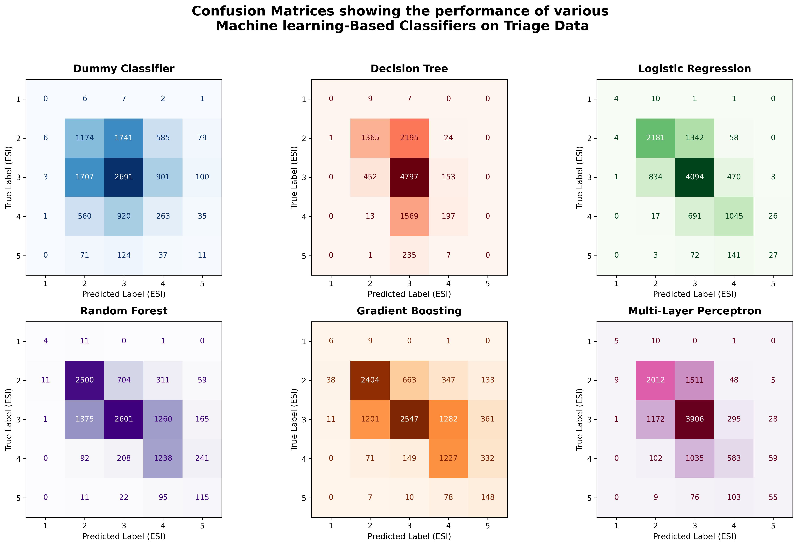

# **Cost Benefit Memo: Machine Learning-Based Classifiers for Emergency Department Triage**

**Author:** Rhys Brown  
**Date:** 20/7/2026  

## **Verdict**

> [!IMPORTANT]
> The **Random Forest** model is recommended for machine learning-based emergency triage as it achieves the lowest under-triage rate across high-volume acuity tiers (ESI 2–5) while retaining the feature-level explainability required for clinician-led triage.

## **Recap**

### 1. Dataset
The dataset contains triage data associated with 55,121 emergency department encounters within the United States. It consists of Emergency Severity Index (ESI) scores alongside `225` features: `200` chief complaint binary variables and `25` vital sign measurements.

A major class imbalance exists as the ESI Level 1 and Level 5 cases make up roughly `0.13%` and `2.00%` of the total cases respectively, leaving little data for the models to learn from.

### 2. Method
A Dummy Classifier, Decision Tree, and Logistic Regression model were initially trained on the triage data to predict an acuity score. Furthermore, engineered features were mathematically derived from vitals to train a Random Forest, Gradient Boosting, and Multi-Layer Perceptron (MLP) model.

Six (6) models in total were evaluated:
- **Dummy Classifier:** Selects output classes based on simple distribution rules rather than patterns in the data; serves as a baseline.
- **Decision Tree:** Classifies data through a series of yes/no decisions. Maximum depth was capped at 10 to balance model capacity against learning noise.
- **Logistic Regression:** Predicts class likelihoods based on linear combinations of features mapped against decision thresholds.
- **Random Forest:** A 'forest' off decision trees that make predictions by collectively voting on for a majority voting.
- **Gradient Boosting:** An algorithm that sequentially fits decision trees to correct residual errors of prior iterations.
- **Multi-Layer Perceptron:** A neural network that combines linear feature weightings and non-linear activation functions to produce output predictions.

## **Benchmark Table**

**Table 1: Benchmark Table comparing the performance of six (6) Classifier Machine Learning Models on Triage Dataset**

| Model | Accuracy | Recall ESI 1 | Macro F1 | Training Time | Inference Time | Explainability |
| :--- | :--- | :--- | :--- | :--- | :--- | :--- |
| **Dummy Classifier** | 0.38 | 0.00 | 0.20 | 4.71 ms | 0.77 ms | N/A. All results generated randomly. |
| **Decision Tree** | 0.58 | 0.00 | 0.27 | 534.48 ms | 1.92 ms | High. A decision chain for each inference can be generated. |
| **Logistic Regression** | 0.67 | 0.25 | 0.49 | 9.84 s | 0.17 ms | High. Coefficients relating features to acuity level can be inspected. |
| **Random Forest** | 0.59 | 0.25 | 0.46 | 26.40 mins | 18.97 ms | Medium. Feature importances exposed; harder to trace than a single tree. |
| **Gradient Boosting** | 0.57 | 0.38 | 0.43 | 24.72 mins | 7.04 ms | Medium. Harder to interpret than decision trees or random forests. |
| **Multi-Layer Perceptron** | 0.60 | 0.31 | 0.45 | 8.27 mins | 1.23 ms | Low. Opaque weight matrices are difficult for humans to interpret. |

> [!NOTE]
> Metrics Definitions:
> - **Accuracy:** The fraction of total predictions that were correct across all ESI classes.
> - **Recall:** The fraction of actual positive cases correctly identified ($\frac{TP}{TP + FN}$).
> - **Precision:** The fraction of positive predictions that were truly positive ($\frac{TP}{TP + FP}$).
> - **Macro F1:** A mean of recall and precision that reflects the balanced discrimination performance of the models.    
> The metrics exist on a scale of [0, 1]:

## **Arguments Supporting Verdict**

### 1. Low Rates of Under-triage for ESI 2–5
As seen in *Figure 1*, the Random Forest model has the highest number of class-wise true positives for all non-ESI 1 classes. This significantly reduces under-triage (predicting a lower acuity tier than the patient's true state). In medicine, under-triage is dangerous because it leads to delayed care for critical patients which has the potential to negatively affect patient outcomes.

**Figure 1:** Confusion matrices for the six (6) classifier models on the triage dataset.

### 2. Low Clinical Need for Machine Learning Assistance in ESI 1 Cases
Although Gradient Boosting `0.38` and Multi-Layer Perceptron `0.31` outperform Random Forest `0.25$` in ESI 1 recall, conversations with medical professionals (e.g., Dr. Loren De Freitas) indicate that ESI 1 cases ush cardiac arrest, severe respiratory failure are immediately self-evident upon arrival. In these emergencies, formal data entry into a software interface is clinically impractical and would likely be bypassed, rendering high ESI 1 algorithmic recall less vital.

### 3. Decent Explainability
Random Forest models offer a higher level of explainability than deep neural networks like Multi-Layer Perceptrons. They expose feature importance metric, allowing clinicians to see which vitals or chief complaints drove the prediction. As physicians retain legal liability and final medical responsibility for triage decisions, transparent reasoning is non-negotiable in order to allow them to validate or override AI recommendations.

## **Arguments Against Verdict**

### 1. Lower Macro Accuracy and F1 Score
- Logistic Regression `0.67` and Multi-Layer Perceptron `0.60` both outperform Random Forest `0.59` in overall accuracy.
- **Counter-Argument:**  Raw accuracy is driven heavily by majority non-urgent classes. Minimizing under-triage in urgent cases remains the primary safety metric; therefore, a slightly lower overall accuracy is an acceptable trade-off.

### 2. Long Inference Time
- The Random Forest model recorded the highest inference time at `18.97 ms`, 2.69 times slower than Gradient Boosting at 7.04ms. This is because the mode consisted of `235` deep trees with a max_depth of `96`.
- **Counter-Argument:**  At under on 50th of a second, computational latency is not the rate-limiting step within the system as data entry by triage staff would take far longer.

### 3. Long Training Time
- Random Forest had the longest training duration (`26.40 minutes`) due to extensive hyperparameter optimization.
- **Counter-Argument:**  model training is a one-time offline process performed prior to deployment and does not impact real-time clinical operation. Moreover, 26.40 minutes is a relatively small time investment compared to most advanced machine learning models.

## **Risks & Recommendation**

The Random Forest model is recommended for this application, but implementation requires caution. The generalizability of this model on regional datasets like Caribbean hospital cohorts remains unverified and requires local validation. Furthermore, the model is only one component of a broader digital triage system. Device interface design, computational speed and clinical staff training must be managed carefully so they do not become operational bottlenecks.

**Final Recommendation:** Proceed with deployment planning for the **Random Forest** model with human-in-the-loop safeguards, followed by further hyperparameter tuning and threshold adjustments to enhance ESI 2–5 recall.